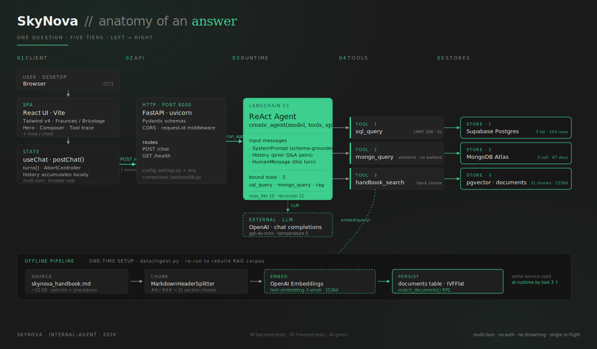

# SkyNova Airlines Agent

> A ReAct AI agent for passenger-service operations — built on **LangChain v1**, **FastAPI**, and **React**. Pulls from Supabase Postgres, MongoDB Atlas, and a pgvector handbook to answer questions across the airline, with the reasoning trail to back up every reply.

---

## Architecture



**Request flow.** Browser → React UI → `useChat` hook → FastAPI → a freshly-built LangChain v1 ReAct agent (`gpt-4o-mini`) → one or more of three tools → live data store. The agent never connects to the data stores directly; every read goes through a typed, guarded tool.

**Three tools.**
- **`sql_query`** — read-only SELECT against Supabase Postgres. Strips comments and string literals, then regex-gates on word boundaries (rejects `INSERT / UPDATE / DELETE / DROP / TRUNCATE / ALTER / GRANT / REVOKE / CREATE / MERGE / VACUUM / COPY / CALL / DO / EXEC / EXECUTE`), bans multi-statement input, and only allows a leading `SELECT` or `WITH … SELECT`. Auto-injects `LIMIT 200` if absent, runs with `SET LOCAL statement_timeout = 5000`. Result rows are truncated to a 50-row / 8 KB wrapper dict so the LLM sees a consistent `{rows, truncated, shown, total}` envelope. Postgres errors come back as `"ERROR: …"` strings so the agent can self-correct without crashing the request.
- **`mongo_query`** — typed args against MongoDB Atlas. Collection whitelist (`support_tickets`, `flight_reviews`, `user_activity_logs`), `limit` capped at `settings.sql_default_limit` (200), aggregation pipelines limited to `$match / $group / $sort / $limit / $project`. A recursive walker rejects `$where` anywhere in `filter` or `pipeline`. Same `{rows, truncated, shown, total}` wrapper; `ObjectId` and `datetime` serialize to strings via `json.dumps(default=str)`.
- **`handbook_search`** — vector RAG over Supabase pgvector. Embeds the query with `text-embedding-3-small` (1536-dim) and calls a `match_documents(query_embedding, match_count, filter)` cosine-similarity RPC. Returns top-k chunks (`k ∈ [1, 10]`) with `{content, section, similarity}` per row; content trimmed to 500 chars.

**Multi-turn, browser-side.** The frontend keeps a `turns[]` history; each `POST /chat` includes `{message, history}` so the agent can resolve "List them" or "What about Gold?" against prior Q&A. The backend stays stateless — context lives in the request body, not on the server.

**No streaming, no auth.** `POST /chat` returns the full `{answer, tool_calls, warnings, elapsed_ms}` envelope once the agent loop terminates (or hits the 10-iteration cap, in which case the answer comes back with a `max_iterations_reached` warning instead of a 500).

---

## Tech stack

| | |
|---|---|
| **Backend** | Python 3.12 · FastAPI · LangChain v1 (`create_agent`) · LangGraph runtime · psycopg3 · pymongo · pydantic-settings · OpenAI Python SDK |
| **Frontend** | Vite · React 19 · TypeScript (strict) · Tailwind v4 (`@theme` CSS-first config) · react-markdown · remark-gfm · lucide-react |
| **Type / fonts** | Fraunces (display serif) · Bricolage Grotesque (body grotesque) · JetBrains Mono (eyebrows / kbd hints) |
| **Models** | OpenAI `gpt-4o-mini` (chat) · `text-embedding-3-small` (RAG) |
| **Data** | Supabase Postgres (5 seed tables, 103 rows) · MongoDB Atlas (3 seed collections, 87 docs) · pgvector `documents` table (31 handbook chunks, IVFFlat index) |
| **Tests** | pytest · pytest-cov · LangChain `GenericFakeChatModel` for unit-level LLM mocking · Vitest · @testing-library/react · MSW (Mock Service Worker) for HTTP mocking |
| **Dev shell** | `uv` for Python · `npm` for frontend · Vite proxy for `/chat` → `:8000` so dev-mode requests never hit CORS |

---

## Quickstart

### 1. Clone

```bash
git clone https://github.com/<your-user>/skynova-airlines-agent.git
cd skynova-airlines-agent
```

### 2. Configure `.env`

Create a `.env` file at the repo root:

```bash
OPENAI_API_KEY=sk-...

# MongoDB Atlas (or local mongo)
MONGODB_URI=mongodb+srv://<user>:<password>@<cluster>.mongodb.net/?appName=skynova
MONGODB_DB=skynova

# Supabase
SUPABASE_URL=https://<project-ref>.supabase.co
SUPABASE_ANON_KEY=eyJ...
# URL-encode any reserved chars in the password (e.g. '@' -> '%40').
SUPABASE_DB_URL=postgresql://postgres.<project-ref>:<URL_ENCODED_PASSWORD>@aws-1-<region>.pooler.supabase.com:5432/postgres
SUPABASE_DB_PROJ_NAME=SkyNova
```

`.env` is gitignored — never commit it. `settings.py` validates the required keys at startup via `pydantic-settings` and fails fast on the first missing one.

### 3. Set up the databases (one-time)

```bash
# Postgres — seed the 5 operational tables and apply the pgvector migration
psql "$SUPABASE_DB_URL" -f data/supabase_seed.sql
psql "$SUPABASE_DB_URL" -f backend/001_pgvector.sql

# MongoDB — load the support_tickets / flight_reviews / user_activity_logs collections
uv sync
uv run python data/load_mongodb.py
```

### 4. Embed the handbook

```bash
uv run python data/ingest.py
# → "Ingested 31 chunks into documents table."
```

Re-runnable after handbook edits — the script `DROP / CREATE`s the chunks for the `skynova_handbook` source so re-running is idempotent.

### 5. Smoke-test connectivity

```bash
uv run python test_connections.py
# → MongoDB · 87 docs    [PASS]
# → Supabase Postgres    [PASS]
# → pgvector documents · 31 chunks    [PASS]
```

---

## Run

Two terminals.

### Backend

```bash
uv run uvicorn backend.app:app --reload --port 8000
```

- `GET /health` → `{"ok": true}`
- `POST /chat` body `{"message": "...", "history": [...]}` → `{answer, tool_calls, warnings, elapsed_ms}`

### Frontend

```bash
cd frontend
npm install
npm run dev
# → http://localhost:5173
```

The Vite dev server proxies `/chat` to `http://localhost:8000` so the browser never makes a cross-origin request — works without any CORS tweaking. (The FastAPI app also allowlists `http://localhost:5173` in `cors_origins` for production-style deploys where the proxy isn't in play.)

### Try it

Open [http://localhost:5173](http://localhost:5173). Click any suggestion chip above the composer — the question fires immediately. The conversation area shows your question, then the indexed **reasoning trail** (collapsible per tool call), then the answer card. Each subsequent question goes through with the previous turns' Q&A as context — so follow-ups like *"List them"* or *"How many of those are Gold?"* resolve correctly.

The four built-in suggestions exercise different tool combinations: pure SQL (Platinum count), pure Mongo (open tickets), pure RAG (pet policy), and Mongo aggregation (lowest-rated flights).

---

## Tests

Two suites — pick the depth.

### Backend (pytest)

```bash
uv run pytest -q                       # all 98 tests, ~12s end-to-end including live DB
uv run pytest tests/unit -q            # 70 unit tests, ~1s, no DB, no LLM
uv run pytest tests/integration -q     # ~6s, live Supabase + live Mongo, LLM mocked
```

| Layer | Speed | DB | LLM | Files |
|---|---|---|---|---|
| **unit** | < 1 s | mocked (fake collection / cursor) | LangChain `GenericFakeChatModel` | `tests/unit/test_{db, sql_query, mongo_query, handbook_search, agent}.py` |
| **integration** | ~6 s | live | mocked via dependency override | `tests/integration/test_{sql_query, mongo_query, handbook_search}_integration.py` + `test_chat_endpoint.py` |

The integration `/chat` test uses FastAPI's `TestClient` plus `app.dependency_overrides[get_model] = lambda: fake` to swap the real OpenAI model for `GenericFakeChatModel`. The fake emits canned `AIMessage` envelopes (some with `tool_calls`) so the full request path runs end-to-end without spending tokens.

### Frontend (Vitest + RTL + MSW)

```bash
cd frontend
npm test                # all 45 tests across 10 files
```

Tests cover: the `postChat` API client (happy path / 5xx → `ChatApiError` / `AbortSignal`), the `useChat` state machine (idle → loading → success / error, concurrent send aborts prior, retry replaces failed turn, reset clears history), each component in isolation (`ChatInput`, `AnswerDisplay`, `ToolCallTrace`, `EmptyState`, `ErrorBanner`, `LoadingSpinner`, `HealthFooter`), and App-level wiring (chips fire send, trace renders alongside answer, error banner shows Retry, `aria-live="polite"` on the response container).

---

## Project structure

```
skynova-airlines-agent/
├── README.md
├── architecture.svg              rendered diagram (embedded above)
├── spec.md                       canonical spec / requirements
├── .env                          (gitignored — your local secrets)
├── settings.py                   pydantic-settings, loads .env once at startup
├── test_connections.py           CLI smoke test for all three data stores
├── pyproject.toml                Python deps + pytest config
│
├── data/                         seed data + loaders, vendored
│   ├── skynova_handbook.md       handbook (RAG source)
│   ├── supabase_seed.sql         5 ops tables + 103 rows
│   ├── mongodb_seed.json         3 support collections + 87 docs
│   ├── load_mongodb.py           one-shot mongo loader
│   ├── ingest.py                 handbook → chunks → embeddings → pgvector
│   ├── SCHEMA.md                 column-by-column schema reference (used as
│   │                             few-shot context in the agent system prompt)
│   ├── MONGODB_SETUP.md          per-store setup notes
│   └── SUPABASE_SETUP.md
│
├── backend/
│   ├── app.py                    FastAPI service · CORS · request-id middleware
│   ├── agent.py                  LangChain v1 build_agent() / run_agent()
│   ├── schemas.py                Pydantic models — ChatRequest, ChatMessage,
│   │                             ChatResponse, ToolCall
│   ├── db.py                     shared psycopg + pymongo connection helpers
│   │                             (get_pg_conn / get_mongo_db) — handles
│   │                             URL-encoded passwords in SUPABASE_DB_URL
│   ├── 001_pgvector.sql          migration: extension, documents table,
│   │                             match_documents RPC, IVFFlat index, RLS
│   └── tools/
│       ├── sql_query.py
│       ├── mongo_query.py
│       └── handbook_search.py
│
├── tests/
│   ├── unit/                     fast, offline, fake LLM / fake collection
│   └── integration/              live Supabase + live Mongo, mocked LLM
│
└── frontend/
    ├── index.html
    ├── vite.config.ts            @tailwindcss/vite plugin + /chat proxy to :8000
    ├── vitest.config.ts          jsdom + jest-dom setup
    ├── tailwind.config            (none — Tailwind v4 lives in @theme inside index.css)
    ├── package.json
    └── src/
        ├── App.tsx               single-screen shell + scrollable conversation
        ├── main.tsx
        ├── index.css             @import "tailwindcss"; @theme {…} brand tokens
        ├── api/
        │   └── chat.ts           postChat() + ChatApiError
        ├── hooks/
        │   └── useChat.ts        turns[] state machine + AbortController
        ├── types/
        │   └── api.ts            mirrors backend/schemas.py
        ├── components/
        │   ├── Logo.tsx          brand-green squircle SVG with chart line
        │   ├── Hero.tsx          empty-state headline
        │   ├── ChatInput.tsx     composer card with Enter / Shift+↵ kbd hints
        │   ├── EmptyState.tsx    4 suggestion cards with tool-tone dots
        │   ├── TurnView.tsx      one Q&A turn (question + spinner / error / trace + answer)
        │   ├── AnswerDisplay.tsx react-markdown with editorial typography
        │   ├── ToolCallTrace.tsx collapsible per-tool cards with indices
        │   ├── LoadingSpinner.tsx
        │   ├── ErrorBanner.tsx   inline Retry button
        │   └── HealthFooter.tsx  one-shot /health check on mount
        └── test/
            ├── server.ts          msw setupServer + default handlers
            └── setup.ts           beforeAll / afterEach / afterAll lifecycle
```

---

## API

### `GET /health`

```json
{ "ok": true }
```

### `POST /chat`

**Request**

```json
{
  "message": "List them",
  "history": [
    { "role": "user",      "content": "How many Platinum customers do we have?" },
    { "role": "assistant", "content": "We have 4 Platinum customers." }
  ]
}
```

`history` is optional; for the first turn the array is empty.

**Response**

```json
{
  "answer": "Here are the four Platinum customers: …",
  "tool_calls": [
    {
      "tool": "sql_query",
      "input": {
        "sql": "SELECT customer_id, first_name, last_name, loyalty_miles FROM customers WHERE loyalty_tier = 'Platinum' ORDER BY loyalty_miles DESC"
      },
      "output_preview": "{\"rows\":[{\"customer_id\":1,\"first_name\":\"Aarav\",…}],\"truncated\":false,\"shown\":4,\"total\":4}"
    }
  ],
  "warnings": [],
  "elapsed_ms": 2843
}
```

**Failure modes**

- `422` — empty / missing `message` (Pydantic `min_length=1` catches both)
- `500` — unhandled exception. Body includes a `request_id` for log correlation; full traceback stays server-side via the `request_id_middleware` in `backend/app.py`
- `200` with `warnings: ["max_iterations_reached"]` — the agent hit `recursion_limit` (default `max_iterations * 2 + 1 = 21` graph steps). The `answer` field carries a graceful fallback message rather than a partial transcript

---

## Security notes

- **SQL is read-only at the regex layer.** Even if the LLM tries to `DELETE`, the tool refuses before reaching Postgres. The regex check strips comments and string literals first, so `SELECT 'INSERT' AS label` and `SELECT created_at FROM customers` both pass through (no false positives on substrings or quoted text). Defense in depth: the `documents` table also has RLS enabled with no policies, and the agent connects via the `postgres` role over a server-side psycopg3 connection — never through PostgREST as `anon`.
- **Mongo aggregation is whitelisted.** `$lookup`, `$out`, `$merge`, `$accumulator`, `$function`, and `$where` are all blocked recursively (not just at the pipeline's top level — the walker checks every dict / list inside `filter` and every stage in `pipeline`).
- **Service-role keys are intentionally absent.** Only the `anon` JWT and the publishable key are referenced by `.env`. Backend writes go directly through the Postgres role for the migration step; runtime only reads.
- **`.env` is gitignored**, along with `node_modules/`, `.venv/`, `dist/`, and the per-phase planning notes (`phase*.md`, `phasef*.md`, `implementation_phased_plan.md`).
- **Request IDs.** Every request gets a `uuid4` either from the incoming `X-Request-ID` header or freshly generated. On 500, the body includes `request_id` so a client error can be correlated with server logs without exposing the traceback.

---

## Frontend design notes

- **Dark + green editorial.** Page background `#1A1A1A` (with two soft brand-green radial glows top-left and bottom-right). Surface cards `#232323`. Single accent: Supabase green `#3ECF8E`, used for the logo's chart line, italic emphasis in the hero, the Send button, the connected-status pulse, list dots, focus rings, and active-flow arrows in the architecture diagram.
- **Three typefaces.** Fraunces variable serif for display + italic emphasis (e.g. *"We'll show our work."* in the hero). Bricolage Grotesque variable grotesque for body. JetBrains Mono for monospace labels, eyebrows, kbd hints, and the reasoning-trail's tool indices (`01 · 02 · 03`).
- **Two surfaces, deliberately.** Conversation area scrolls; composer + caption stay pinned to the bottom. `aria-live="polite"` on the conversation container so screen readers announce new turns. `role="status"` on the loading spinner, `role="alert"` on the error banner.
- **Tool-call trace is collapsible.** Each card shows a tool-aware compact preview in the header (`sql_query — SELECT loyalty_tier, COUNT(*)` for SQL, `support_tickets · find` for Mongo, the query string for handbook_search) plus the colored Lucide icon. Click to expand the pretty-printed `input` JSON and the `output_preview` string.

---

## Roadmap

Out of scope for this build, deliberately:

- **Token streaming** + SSE / WebSocket transport + live tool-event surfacing
- **Server-side history persistence** (currently the multi-turn history lives in the browser; a page refresh wipes it)
- **Authentication** (Supabase Auth, JWT, …)
- **Tavily / web-search 4th tool** for questions the local data can't answer
- **e2e test tier** (`RUN_E2E=1` against live OpenAI + per-question tool-set assertions covering the 5 worked spec questions)
- **Drop the stale `handbook_chunks` table** in Supabase (artifact from earlier development; `documents` is the live RAG store)
- **Docker / hosted deployment**

Each of these is a tractable add-on on top of the current architecture.

---

## License

MIT
